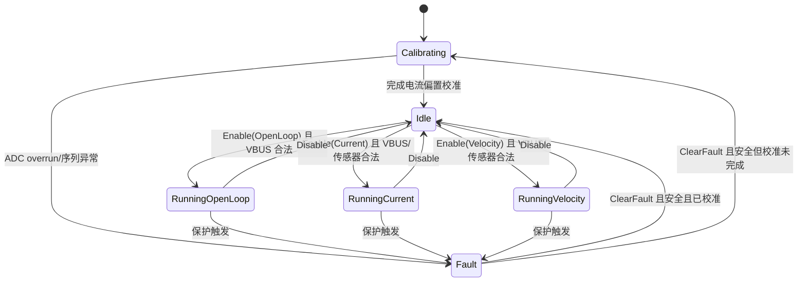
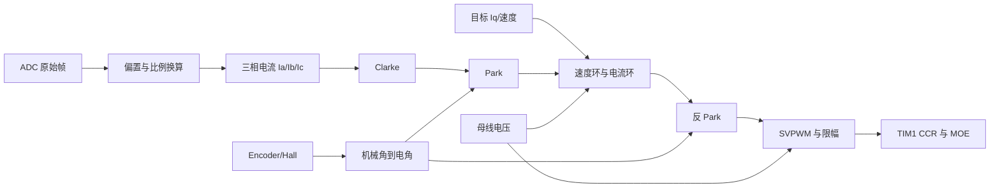

# STM32G473 三相 FOC 固件软件设计说明

> **文档状态：** 当前实现基线  
> **适用目录：** `software/firmware`  
> **目标平台：** STM32G473RC / ARM Cortex-M4F  
> **软件栈：** Rust 2024、Embassy、`no_std`  
> **更新日期：** 2026-09-11

## 1. 文档目的

本文描述三相 PMSM/BLDC FOC 固件的软件需求、总体架构、控制流程、硬件抽象、通信协议、保护策略、配置项、测试状态和已知限制。

本文以当前 Rust 固件源码为运行时行为的主要依据：

- `software/firmware/src/`
- `software/firmware/Cargo.toml`
- `software/firmware/.cargo/config.toml`

根目录 `README.md` 和硬件 KiCad 文件用于提供系统背景与板级映射，但不能替代目标板测量。CubeMX `.ioc` 文件仅作为辅助参考，不是当前 Rust 固件配置的唯一依据。

## 2. 当前结论

当前固件已经完成主要软件功能并可为以下两种传感器配置生成 STM32G473RC ARM 固件：

- 默认 Encoder：`sensor-encoder`
- 可选 Hall：`sensor-hall`

已实现的主要能力包括：

- 100 kHz、中心对齐、三相互补 PWM；
- 200 ns 配置死区；
- 定时器触发的三相电流、母线电压和温度采样；
- 电流 FOC、速度 FOC 和开环运行模式；
- 电流偏置校准、Clarke/Park 变换、PID 和 SVPWM；
- UART 调试控制；
- Classic CAN 控制与遥测；
- 软件过流、残差、母线电压、温度、堵转、传感器和控制超时保护；
- 带版本和 CRC 的双槽 Flash 参数持久化，支持通过 UART 和 CAN 读取、设置、保存和恢复参数。
- 电机参数自整定（Auto-Tune）：一键完成 Rs/L/磁链辨识、电流环 PI 计算与阶跃验证、开环运行校验、观测器参数配置，并保存为带 CRC 的电机参数档案。

当前状态属于**可上板联调的软件工程版本**，不是经过目标板电气、热、EMI 和故障响应鉴定的生产固件。

## 3. 设计目标与非目标

### 3.1 设计目标

1. 在 STM32G473RC 上实现无堆分配的实时 FOC 控制路径。
2. 使用 TIM1 输出三相中心对齐互补 PWM。
3. 使用定时器事件触发 ADC 注入转换，使电流采样与 PWM 同步。
4. 默认以 100 kHz 执行电流环，以 1 kHz 执行速度环。
5. 编译期选择 Encoder 或 Hall 转子传感器后端。
6. 将控制核心与 STM32 外设实现分离，使核心算法能够在主机上测试。
7. 通信任务不得直接操作 PWM 或控制器硬件。
8. 故障发生时锁存故障并立即撤销桥使能请求。
9. 对命令中的非有限浮点数、错误长度和非法帧进行拒绝处理。
10. 在本轮实现中仅使用软件保护，并明确记录其能力边界。
11. 提供带版本和 CRC 的双槽 Flash 参数持久化；Flash 擦写期间暂停电流采样，且仅在桥未使能时执行。

### 3.2 当前非目标

以下内容有意不属于当前实现：

- COMP → DAC → TIM1 BRK/BKIN 硬件过流链；
- 位置无传感器估算器（自整定仅输出观测器参数，观测器本身尚未实现）；
- 自动编码器/Hall 方向和电角度零点标定；
- 弱磁、MTPA、前馈解耦和高级调制策略；
- CANopen、UAVCAN 或其他高层 CAN 协议；
- Bootloader、在线升级和安全启动；
- 生产级功能安全或电气安全认证。

## 4. 关键运行参数

| 参数 | 当前默认值 | 说明 |
|---|---:|---|
| MCU | STM32G473RC | 170 MHz Cortex-M4F |
| SYSCLK | 170 MHz | HSI / 4 × 85 / 2 |
| PWM 定时器 | TIM1 | 三路主输出及三路互补输出 |
| PWM 模式 | 中心对齐 | `CenterAlignedBothInterrupts` |
| PWM 频率 | 100 kHz | 同时作为控制器默认电流环频率 |
| PWM 周期 | 10 µs | 必须通过目标板 WCET 测量确认余量 |
| 死区 | 200 ns | 170 MHz 下 `DEAD_TIME_TICKS = 34` |
| 占空比限制 | 5%～95% | 由 SVPWM 输出约束 |
| 速度环频率 | 1 kHz | 默认每 100 个电流环周期运行一次 |
| 遥测发布频率 | 约 1 kHz | 控制任务向内部 `Watch` 发布 |
| CAN 遥测周期 | 10 ms | 每周期依次发送 3 个遥测帧 |
| UART | 115200 baud | USART3，ASCII 行协议 |
| CAN | 500 kbit/s | FDCAN1，Classic CAN 标准帧 |
| 电流校准样本数 | 1024 | 上电后保持桥关闭并计算三相 ADC 偏置 |
| 默认极对数 | 4 | 必须按实际电机修改 |
| 默认编码器 CPR | 4096 | 必须按实际编码器修改 |
| 默认电池串数 | 6S | 可在桥未运行时通过命令改为 2S～6S |
| 默认电流限制 | 50 A | 控制限制，不代表硬件连续电流能力 |
| 软件过流阈值 | 55 A | 连续 3 个采样周期后锁存 |
| 参数存储 | 2 × 4 KB Flash 双槽 | Flash 顶部 `0x0803E000`/`0x0803F000`，CRC32 加提交标记 |
| 电机参数档案 | 2 × 4 KB Flash 双槽 | `0x0803C000`/`0x0803D000`，`MTRP` 记录，自整定写入 |

## 5. 软件总体架构

### 5.1 分层

```text
┌──────────────────────────────────────────────────────────────┐
│                        src/main.rs                           │
│ 时钟、引脚、外设初始化、编译期特性检查、Embassy 任务启动    │
└──────────────────────────────┬───────────────────────────────┘
                               │
       ┌───────────────────────┼────────────────────────┐
       │                       │                        │
       ▼                       ▼                        ▼
┌───────────────┐      ┌────────────────┐      ┌────────────────┐
│bsp_hardware.rs│      │  comm_task.rs  │      │  foc_core.rs   │
│PWM/ADC/传感器 │      │UART/CAN/通道   │      │状态机/控制/保护│
└───────┬───────┘      └────────┬───────┘      └────────┬───────┘
        │                       │                       │
        │                ┌──────▼──────┐       ┌────────▼────────┐
        │                │interfaces.rs│       │foc_math.rs/pid.rs│
        │                │数据与命令类型│       │变换/SVPWM/PID   │
        │                └─────────────┘       └─────────────────┘
        │
        ▼
┌────────────────┐
│  hardware.rs   │
│PWM/传感器 trait│
└────────────────┘
```

### 5.2 模块职责

| 文件 | 职责 |
|---|---|
| `src/main.rs` | 编译期传感器互斥检查、RCC 配置、外设初始化、中断优先级、参数请求处理和任务启动 |
| `src/lib.rs` | 导出硬件无关模块，并仅在 ARM 目标导出 BSP |
| `src/interfaces.rs` | 控制模式、状态、命令、ADC 帧、转子样本、故障位、遥测、控制输出和参数协议类型 |
| `src/hardware.rs` | 定义 `PwmBridge` 和 `RotorSensor` trait |
| `src/foc_math.rs` | 角度归一化、正余弦近似、Clarke/Park/反 Park、SVPWM |
| `src/pid.rs` | 固定周期 PID、限幅、抗积分饱和、斜率限制和异常值处理 |
| `src/foc_core.rs` | 校准、状态机、电流环、速度环、保护、功率/热模型、遥测生成和运行参数热更新 |
| `src/parameters.rs` | 版本化参数注册表、范围/关系校验、payload 编解码和配置档转换 |
| `src/parameter_store.rs` | 双槽 Flash 记录格式、CRC32、两阶段提交和 generation 管理 |
| `src/parameter_service.rs` | 工作档/持久档状态、脏标记和重启需求跟踪 |
| `src/motor_param.rs` | 统一电机参数结构 `MotorParam`、默认值、校验、payload 编解码和配置映射 |
| `src/autotune.rs` | 自整定状态机：注入采样、状态推进、PI 计算、验证与保存请求 |
| `src/autotune_measure.rs` | 纯算法：最小二乘拟合、中位数/离群点剔除、阶跃响应指标 |
| `src/bsp_flash.rs` | embassy-stm32 阻塞 Flash 后端，仅在 ARM 目标编译 |
| `src/bsp_hardware.rs` | TIM1、ADC1/2/3、ADC ISR、Encoder QEI、Hall 捕获及 STM32 引脚实现 |
| `src/comm_task.rs` | UART 解析、CAN 编解码、命令队列、参数请求队列、参数响应编码及通信任务 |

### 5.3 架构原则

- **单一硬件所有者：** `motor_control_task` 独占 PWM 和转子传感器实例。
- **通信隔离：** UART/CAN 只产生 `Command`，不直接访问 PWM 或 FOC 控制器。
- **核心可测试：** `FocController` 只依赖值类型和纯算法，不依赖 STM32 寄存器。
- **静态资源：** ADC 句柄、信号、命令通道和遥测 Watch 均使用静态分配。
- **故障优先：** 任何锁存故障都会使控制输出的 `bridge_enabled` 为 `false`。
- **源码为准：** 外设、时钟和协议行为以 Rust 实现为准，不从 `.ioc` 自动生成。

## 6. 编译期配置

`Cargo.toml` 定义两个互斥特性：

```toml
[features]
default = ["sensor-encoder"]
sensor-encoder = []
sensor-hall = []
```

`main.rs` 在以下情况产生编译错误：

- 同时启用 `sensor-encoder` 和 `sensor-hall`；
- 两者均未启用。

默认构建使用 Encoder：

```bash
cargo --config "software/firmware/.cargo/config.toml" build \
  --manifest-path "software/firmware/Cargo.toml" \
  --target thumbv7em-none-eabihf --release --bin foc-firmware
```

Hall 构建使用：

```bash
cargo --config "software/firmware/.cargo/config.toml" build \
  --manifest-path "software/firmware/Cargo.toml" \
  --target thumbv7em-none-eabihf --release --bin foc-firmware \
  --no-default-features --features sensor-hall
```

## 7. 启动流程

固件启动顺序如下：

1. 配置 HSI 和 PLL，使 SYSCLK 为 170 MHz。
2. 为 FDCAN 选择 PLL1Q 内核时钟，为 ADC12/ADC345 选择 SYSCLK。
3. 初始化 STM32 外设句柄。
4. 从 Flash 双槽加载最新参数档；读取失败或无有效记录时回退到编译默认值并输出告警。
5. 将参数档应用到 `FocConfig`；Encoder CPR 和 Hall 极对数按加载后的参数初始化。
6. 配置中断优先级：
   - ADC1_2：P1；
   - TIM3：P4；
   - USART、DMA、FDCAN：P6。
7. 将 PA6 配置为下拉输入占位，但不连接到 TIM1 Break。
8. 初始化 TIM1 互补 PWM，并保持 MOE 关闭。
9. 初始化 ADC1、ADC2、ADC3 注入转换资源。
10. 根据编译特性初始化 Encoder 或 Hall 后端。
11. 初始化 USART3 和 FDCAN1。
12. 启动 UART、CAN 接收、CAN 遥测和电机控制任务。
13. 电机控制任务启用 ADC1_2 中断。
14. 控制器进入 `Calibrating`，累计默认 1024 个电流零偏样本。
15. 校准完成后进入 `Idle`，等待有效的使能命令。

在完成校准且满足运行条件前，TIM1 MOE 保持关闭。

## 8. 并发与任务模型

### 8.1 Embassy 任务

| 任务 | 触发方式 | 主要职责 |
|---|---|---|
| `motor_control_task` | 等待 ADC 帧；另有 100 µs 等待超时 | 消费命令、读取转子、执行控制器、更新 PWM、发布遥测 |
| `uart_task` | USART3 异步接收 | 解析 ASCII 行、发送命令、按需输出状态 |
| `can_receive_task` | FDCAN1 异步接收 | 验证帧格式和 DLC、解码命令、写入命令队列 |
| `can_telemetry_task` | 10 ms 定时器 | 读取最新遥测并发送三个 Classic CAN 帧 |

### 8.2 同步原语

- ADC ISR → 控制任务：单槽 `Signal<RawAdcFrame>`；
- UART/CAN → 控制任务：容量为 16 的 `Channel<Command>`；
- 控制任务 → UART/CAN：容量语义为最新值的 `Watch<Telemetry>`；
- ADC 句柄：`CriticalSectionMutex<RefCell<Option<...>>>`。

单槽 ADC 信号有意只保留最新数据。控制任务开始消费后，如果下一帧覆盖尚未消费的帧，ISR 会设置 `overrun`。控制器还会检查 ADC 序列号是否连续，因此漏帧会转化为锁存的控制超时故障。

### 8.3 实时边界

100 kHz 对应 10 µs 控制周期。当前架构要求在目标板上验证：

- ADC 注入序列能在周期预算内完成；
- ISR 读取和信号发布不会造成不可接受的抖动；
- 控制任务最坏执行时间小于周期并具有足够余量；
- UART/CAN 活动不会使线程执行器上的控制任务漏帧。

100 µs 的等待超时是无 ADC 帧时的兜底路径；正常运行中的连续性主要通过单槽覆盖标志和序列号检查检测。

## 9. PWM 设计

### 9.1 引脚映射

| 相位 | 高侧 | 低侧互补 | TIM1 通道 |
|---|---|---|---|
| A/U | PA8 | PB13 | CH1 / CH1N |
| B/V | PA9 | PB14 | CH2 / CH2N |
| C/W | PA10 | PB15 | CH3 / CH3N |

### 9.2 配置

TIM1 当前配置：

- 100 kHz；
- 中心对齐计数；
- 三路普通输出和三路互补输出；
- 34 tick 死区；
- 重复计数器为 1；
- TRGO2 来源为更新事件；
- 禁用自动输出使能；
- 禁用 BRK、BRK2 和相关输入；
- 普通输出和互补输出的空闲状态均为低；
- 初始化时写入 50% 中性比较值，但 MOE 保持关闭。

### 9.3 启停语义

`PhaseDuty::DISABLED` 的三个占空比值均为 0.5。安全关闭依赖 TIM1 MOE 被清除，而不是依赖比较值为零：

```text
运行：更新 CCR → 设置 MOE
空闲/故障：清除 MOE → 写入中性比较值
```

因此，上板时必须测量复位、初始化、空闲、故障和 MCU 异常状态下的实际栅极输出。

## 10. ADC 采样设计

### 10.1 通道映射

| ADC | 引脚 | 信号 | 注入序列 |
|---|---|---|---|
| ADC1 | PA0 | A 相电流 | Rank 1 |
| ADC1 | PA2 | VBUS | Rank 2 |
| ADC1 | PA3 | TMP235 | Rank 3 |
| ADC2 | PA1 | B 相电流 | 单通道 |
| ADC3 | PB0 | C 相电流 | 单通道 |

所有注入转换均由 TIM1 TRGO2 上升沿触发。ADC1 注入转换完成中断作为控制帧边界；ISR 随后读取三个 ADC 实例的结果。

### 10.2 原始数据帧

```rust
RawAdcFrame {
    phase_a: u16,
    phase_b: u16,
    phase_c: u16,
    bus_voltage: u16,
    ntc: u16,
    sequence: u32,
    overrun: bool,
}
```

ISR 只执行以下操作：

1. 读取注入转换结果；
2. 递增序列号；
3. 检查单槽信号是否覆盖；
4. 发布 `RawAdcFrame`。

FOC 浮点计算不在 ADC ISR 内执行。

### 10.3 电流换算

默认参数：

- ADC 参考电压：3.3 V；
- ADC 满量程：4095；
- INA240 增益：50 V/V；
- 分流电阻：0.5 mΩ。

每 ADC count 对应的电流约为：

```text
3.3 / 4095 / (50 × 0.0005) ≈ 0.03223 A/count
```

校准阶段分别平均三个相位的原始 ADC 值。运行阶段按以下方式换算：

```text
i_phase = (raw_phase - offset_phase) × amperes_per_count
```

### 10.4 VBUS 与温度换算

VBUS 默认分压为 100 kΩ / 10 kΩ：

```text
Vbus = ADC × 3.3 / 4095 × (100k + 10k) / 10k
```

TMP235 默认近似：

```text
Temperature = (Vadc - 0.5 V) / 0.01 V/°C
```

这些比例必须使用装配板和校准仪器确认。

## 11. 转子传感器设计

### 11.1 统一接口

```rust
pub trait RotorSensor {
    fn sample(&mut self, dt: f32) -> RotorSample;
}
```

返回值包含：

- 机械角度；
- 机械角速度；
- 有效标志。

电流和速度模式要求传感器有效；开环模式不要求转子传感器有效。

### 11.2 Encoder 后端

- 外设：TIM3 QEI；
- 引脚：PB4/PB5；
- 输入：上拉；
- 默认计数范围：0～4095；
- 通过计数回绕差计算机械速度；
- 通过每圈计数转换机械角度。

当前 Encoder 后端始终将成功读取的计数报告为有效。仅凭静止 QEI 计数无法区分“转子静止”和某些“编码器断线/无脉冲”情况，因此当前实现不提供完整的静止断线诊断。

### 11.3 Hall 后端

- 外设：TIM3 输入捕获；
- 引脚：PC6/PC7/PC8；
- 三通道双边沿捕获；
- 定时器频率：10 kHz；
- 识别 6 个合法 Hall 状态；
- 拒绝 `000`、`111` 和非相邻扇区跳变；
- 根据捕获间隔和跳变方向估计电角速度；
- 在合法跳变之间按估计速度插值电角度；
- 超过 0.5 s 没有跳变时将估计速度置零。

Hall 静止状态也可能在电气上保持为一个合法码。若要覆盖更多线缆故障，需要额外硬件诊断或依赖运行目标的合理性检查。

## 12. 控制器状态机

### 12.1 状态



实际类型使用 `MotorState::Running(ControlMode)` 表示三个运行状态。

### 12.2 使能条件

只有控制器处于 `Idle` 且没有故障时才接受使能：

- VBUS 必须位于当前电池串数对应范围内；
- `Current` 和 `Velocity` 模式要求最近转子样本有效；
- `OpenLoop` 模式不要求传感器有效；
- `Idle` 不能作为有效使能模式。

### 12.3 禁用

`Disable` 会：

- 将正常运行状态切换为 `Idle`；
- 清除上次占空比请求；
- 重置电流和速度 PID 历史；
- 不清除锁存故障；
- 不会中断正在进行的偏置校准。

### 12.4 清除故障

仅在 `Fault` 状态并且满足安全条件时清除故障：

- 估算结温低于关断温度；
- 母线电压不高于当前串数上限；
- 若校准已完成，三相电流绝对值最大值小于 1 A。

校准未完成时发生故障，成功清故障后会重新开始完整偏置校准。

## 13. FOC 数据路径



### 13.1 电角度

闭环模式下：

```text
electrical_angle = normalize(
    sensor_direction × pole_pairs × mechanical_angle - electrical_zero
)
```

开环模式下：

```text
open_loop_angle += open_loop_electrical_velocity × dt
```

### 13.2 电流环

默认每个 ADC 帧执行一次，即标称 100 kHz：

- `Id` 目标固定为 0；
- `Iq` 来自电流命令或速度 PID；
- `Iq` 受温度降额后的电流上限约束；
- d/q 电压输出分别限制到母线电压的 0.5 倍；
- PID 包含输出饱和和条件积分抗饱和。

当前没有实现 d/q 电压矢量的联合圆形限幅；两个轴分别限幅，最终由 SVPWM 对相电压请求整体缩放。

### 13.3 速度环

默认每 100 个电流环周期执行一次，即 1 kHz。速度 PID 输出作为 `Iq` 目标，并受温度降额电流限制。

### 13.4 开环模式

开环模式直接指定：

- 电角速度；
- q 轴电压。

q 轴电压在使用前限制为：

```text
-0.5 × VBUS <= Uq <= 0.5 × VBUS
```

### 13.5 SVPWM

当前实现使用最小值/最大值零序注入：

1. 将 αβ 电压转换为三相电压；
2. 计算三相最大值和最小值；
3. 注入 `-0.5 × (max + min)` 共模分量；
4. 超过可用调制范围时按比例缩小；
5. 将最终占空比限制到 5%～95%。

非法母线电压、非有限 αβ 电压或非法占空比边界会返回禁用占空比。

## 14. PID 设计

`PidController` 保存：

- 配置参数；
- 积分项；
- 上一次误差；
- 上一次输出；
- 初始化标志。

更新过程：

1. 拒绝非有限误差、非有限 `dt` 或非正 `dt`；
2. 计算比例项；
3. 首次执行时不计算微分项；
4. 计算并限幅候选积分项；
5. 仅在未饱和或误差有助于退出饱和时接受积分；
6. 对总输出限幅；
7. 配置有限且为正的 `output_ramp` 时执行变化率限制；
8. 中间结果非有限时复位控制器并返回零。

默认参数：

| 控制器 | Kp | Ki | Kd | 输出限制 | 输出斜率 |
|---|---:|---:|---:|---:|---:|
| d/q 电流 PID | 0.2 | 20.0 | 0.0 | 30.0 | 无穷大，默认不限制 |
| 速度 PID | 0.4 | 2.0 | 0.0 | 50.0 | 200.0 |

这些是软件默认值，不是针对实际电机完成整定后的参数。

## 15. 保护设计

### 15.1 故障位

| 位 | 名称 | 触发条件 |
|---:|---|---|
| 0 | `OVER_CURRENT` | 任一相电流超过阈值并达到去抖计数 |
| 1 | `CURRENT_RESIDUAL` | `abs(Ia + Ib + Ic)` 超过阈值并达到去抖计数 |
| 2 | `UNDER_VOLTAGE` | 运行时 VBUS 低于当前电池串数下限 |
| 3 | `OVER_VOLTAGE` | 运行时 VBUS 高于当前电池串数上限 |
| 4 | `OVER_TEMPERATURE` | 估算结温达到关断温度 |
| 5 | `STALL` | 速度模式下持续满足堵转条件 |
| 6 | `SENSOR` | 需要传感器的模式持续收到无效样本 |
| 7 | `CONTROL_OVERRUN` | ADC 覆盖、序列不连续、控制等待超时 |
| 8 | `INVALID_COMMAND` | 已预留；当前被拒绝的协议命令不会锁存此位 |

### 15.2 默认阈值

| 项目 | 默认值 |
|---|---:|
| 软件过流阈值 | 55 A |
| 软件过流去抖 | 3 个电流采样 |
| 三相残差阈值 | 3 A |
| 残差去抖 | 20 个电流采样 |
| 单体欠压 | 3.0 V |
| 单体过压 | 4.25 V |
| 开始温度降额 | 100 °C |
| 温度关断 | 125 °C |
| 传感器无效时间 | 2 ms |
| 堵转目标速度阈值 | 10 rad/s |
| 堵转最大实测速度 | 1 rad/s |
| 堵转最小 Iq | 10 A |
| 堵转持续时间 | 0.5 s |

### 15.3 故障行为

`trip()` 会：

1. 设置对应故障位；
2. 将控制器状态切换为 `Fault`；
3. 将最后占空比重置为禁用值；
4. 使本周期输出的 `bridge_enabled` 为 `false`；
5. 由电机控制任务清除 TIM1 MOE。

故障保持锁存，必须显式发送 `ClearFault` 且满足安全条件才能恢复。

### 15.4 热模型

软件使用简化的一阶模型：

```text
P_conduction = Rds_hot × (Ia² + Ib² + Ic²)
T_target_rise = P_conduction × Rth
```

估算结温以热时间常数趋近目标温升，并取估算值与 TMP235 测量值中的较高值。100～125 °C 之间线性降低允许电流，到 125 °C 关断。

该模型不包含开关损耗、体二极管、PCB 热阻变化和风冷条件，必须通过实测修正。

### 15.5 软件保护边界

当前固件明确关闭：

- TIM1 BRK；
- TIM1 BRK2；
- Break 输入引脚；
- 自动输出使能；
- COMP/DAC 硬件阈值链。

因此，软件过流响应依赖 ADC 转换、ADC ISR、Embassy 调度和控制任务均正常运行，不能代替独立硬件快速关断。

## 16. 命令模型

`Command` 支持：

```text
Enable(mode)
Disable
ClearFault
SetIq(iq)
SetVelocity(velocity)
SetOpenLoop { electrical_velocity, q_voltage }
SetCellCount(cells)
SetElectricalZero(angle)
SetCurrentPid(config)
SetVelocityPid(config)
ReportControlOverrun
```

边界规则：

- `Iq` 被限制到正负电流上限；
- 机械速度被限制到配置最大机械速度；
- 开环电角速度被限制到配置最大开环速度；
- 非有限浮点命令被忽略或在协议解析层拒绝；
- 电池串数只接受 2～6；
- 电池串数、电角度零点和 PID 只允许在桥未请求运行时修改；
- 被拒绝的命令当前不会自动锁存 `INVALID_COMMAND`。

`SetCellCount`、`SetElectricalZero`、`SetCurrentPid` 和 `SetVelocityPid` 被控制器接受后，控制任务会把当前运行配置同步回参数工作档，保证后续 `param save` 写入 Flash 的档与实际运行配置一致。

`AutoTuneStart` 和 `AutoTuneStop` 由电机控制任务直接处理（不进入 `FocController`）：前者要求控制器处于 `Idle` 且桥未使能，后者在任何状态下立即撤销桥使能并回到 `Idle`。

## 17. UART 协议

### 17.1 物理配置

| 项目 | 配置 |
|---|---|
| 外设 | USART3 |
| TX | PB10 |
| RX | PB11 |
| 波特率 | 115200 |
| 格式 | ASCII 行，以 `\n` 结束；忽略 `\r` |
| 接收缓冲 | 128 字节 |

### 17.2 命令

| 命令 | 说明 |
|---|---|
| `enable open` | 启用开环模式 |
| `enable current` | 启用电流模式 |
| `enable velocity` | 启用速度模式 |
| `mode ...` | `enable` 的别名 |
| `disable` | 请求进入空闲并关闭桥 |
| `clear` / `clear-fault` | 请求安全清除锁存故障 |
| `iq <A>` | 设置 q 轴电流目标 |
| `velocity <rad/s>` | 设置机械角速度目标 |
| `open <electrical-rad/s> <Vq>` | 设置开环电角速度和 q 轴电压 |
| `cells <2..6>` | 设置电池串数；桥运行时不会生效 |
| `zero <rad>` | 设置电角度零点；桥运行时不会生效 |
| `current-pid <kp> <ki> <kd> <limit> <ramp>` | 设置电流 PID；所有参数必须为有限值 |
| `velocity-pid <kp> <ki> <kd> <limit> <ramp>` | 设置速度 PID；所有参数必须为有限值 |
| `param get <name>` | 读取单个参数值 |
| `param set <name> <value>` | 设置单个参数；仅在桥未使能且存储操作安全时生效 |
| `param show` | 逐行输出全部 43 个参数 |
| `param status` | 输出参数存储状态（valid/source/generation/dirty/restart-required） |
| `param save` | 把当前工作档写入 Flash 双槽 |
| `param load` | 从 Flash 重新加载最新档 |
| `param defaults` | 工作档恢复默认值；不写 Flash |
| `param factory-reset` | 强制把默认档写入 Flash 双槽 |
| `autotune start` | 启动电机参数自整定；仅当控制器 `Idle` 且桥未使能时接受 |
| `autotune stop` | 中止自整定并关闭桥 |
| `autotune status` | 输出自整定状态行（state/error/progress/辨识值） |
| `status` | 输出最新遥测摘要 |

成功接收命令返回 `ok`；解析失败返回 `error`；尚无遥测时返回 `not-ready`。

参数命令成功时按操作返回 `param <name>=<value>` 或 `ok ...` 行；失败时返回 `error <结果名>`，结果名包括 `busy`、`invalid`、`no-valid-record`、`flash-read`、`flash-erase`、`flash-program`、`verify` 等。参数名即 `ParameterId` 的名称，例如 `param set current-kp 0.35`。

超长行会整体丢弃到下一个换行符，并返回 `line-too-long`。被丢弃行的后缀不会被当作新的命令。

### 17.3 状态输出

UART 状态包含：

- ADC 序列号；
- 状态码；
- 故障位图；
- 三相电流；
- d/q 电流；
- VBUS；
- 机械速度；
- 估算结温。

## 18. Classic CAN 协议

### 18.1 总线配置

| 项目 | 配置 |
|---|---|
| 外设 | FDCAN1 |
| RX | PA11 |
| TX | PA12 |
| 比特率 | 500 kbit/s |
| 帧格式 | Classic CAN、标准 11-bit ID、数据帧 |
| 字节序 | 小端 |

自整定目前仅通过 UART 触发，未定义 CAN 帧（多节点部署前需补充节点寻址与事务语义）。

接收路径拒绝：

- Remote frame；
- CAN FD frame；
- 扩展 ID；
- 未知 ID；
- DLC 与命令定义不完全一致的帧；
- 包含 NaN 或 Infinity 的浮点命令；
- `0x106`/`0x107` 参数帧中保留字节不为 0 的帧。

### 18.2 命令帧

| ID | DLC | Payload |
|---:|---:|---|
| `0x100` | 1 | 控制码：0=Disable，1=ClearFault，2=OpenLoop，3=Current，4=Velocity |
| `0x101` | 4 | `f32` Iq 目标，单位 A |
| `0x102` | 4 | `f32` 机械速度目标，单位 rad/s |
| `0x103` | 8 | `f32` 电角速度 + `f32` q 轴电压 |
| `0x104` | 1 | 电池串数 |
| `0x105` | 4 | `f32` 电角度零点，单位 rad |
| `0x106` | 8 | 参数操作：byte0=事务号，byte1=操作（0=Status，1=Save，2=Load，3=Defaults，4=FactoryReset），byte2..7 必须为 0 |
| `0x107` | 8 | 参数访问：byte0=事务号，byte1=操作（0=Get，1=Set），byte2=参数 ID，byte3=0，byte4..7=值（Get 时必须为 0） |

参数值按类型编码为 4 字节小端：U8/I8 占 byte4，U16 占 byte4..6，F32 占 byte4..8。同一事务号重复发送相同请求会返回缓存结果；同一事务号发送不同请求会被拒绝为 `Conflict`。

### 18.3 遥测帧

#### `0x180` 状态帧

| Byte | 内容 |
|---:|---|
| 0 | 状态码 |
| 1..4 | `u32` 故障位图，小端 |
| 5 | 传感器有效标志 |
| 6..7 | ADC 序列号低 16 位，小端 |

状态码：

| 值 | 状态 |
|---:|---|
| 0 | Calibrating |
| 1 | Idle |
| 2 | Running(OpenLoop) |
| 3 | Running(Current) |
| 4 | Running(Velocity) |
| 5 | Fault |

#### `0x181` 电流帧

四个连续的小端 `i16`：

| Byte | 内容 | 比例 |
|---:|---|---:|
| 0..1 | Ia | 0.01 A/LSB |
| 2..3 | Ib | 0.01 A/LSB |
| 4..5 | Ic | 0.01 A/LSB |
| 6..7 | 平均母线电流 | 0.01 A/LSB |

#### `0x182` 运动与状态帧

| Byte | 类型 | 内容 | 比例 |
|---:|---|---|---:|
| 0..1 | `u16` | VBUS | 0.01 V/LSB |
| 2..3 | `i16` | 机械速度 | 0.01 rad/s/LSB |
| 4..5 | `u16` | 机械角度 | 0.001 rad/LSB |
| 6..7 | `i16` | 估算结温 | 0.1 °C/LSB |

发送代码以 `u16` 字节容器承载有符号速度和温度，接收端必须按 `i16` 解释对应字段。

#### `0x183` 参数操作结果帧

| Byte | 内容 |
|---:|---|
| 0 | 事务号 |
| 1 | 操作码（同 `0x106`） |
| 2 | 结果码（见下表） |
| 3 | 存储标志位：bit0=persisted_valid，bit1=dirty，bit2=restart_required，bit3=source_defaults |
| 4..8 | `u32` generation，小端 |

#### `0x184` 参数访问结果帧

| Byte | 内容 |
|---:|---|
| 0 | 事务号 |
| 1 | 操作码（0=Get，1=Set） |
| 2 | 参数 ID |
| 3 | 结果码；bit7 置位表示参数需重启后生效 |
| 4..8 | 参数值，按类型小端编码（同 `0x107`） |

参数结果码：

| 值 | 名称 | 含义 |
|---:|---|---|
| 0 | Success | 成功 |
| 1 | Unchanged | 内容未变化，未写入 Flash |
| 2 | Busy | 控制器忙或不满足安全条件 |
| 3 | Invalid | 参数 ID、类型或取值非法 |
| 4 | NoValidRecord | Flash 中无有效参数档 |
| 5..7 | FlashRead/FlashErase/FlashProgram | Flash 读/擦/写失败 |
| 8 | Verify | 写后校验失败 |
| 9 | Unknown | 未知参数 |
| 10 | QueueFull | 请求队列满 |
| 11 | Conflict | 事务号冲突 |

## 19. 遥测与诊断

内部 `Telemetry` 包含：

- 状态和故障位；
- 三相电流；
- d/q 电流和 d/q 电压；
- 三相占空比；
- 机械角度和速度；
- 传感器有效标志；
- 母线电压；
- TMP235 原始值；
- 瞬时和低通母线电流；
- 输入和输出功率估算；
- 估算结温；
- 当前 Iq 和速度目标。

母线电流和功率使用以下诊断估算：

```text
Ibus ≈ da × Ia + db × Ib + dc × Ic
Pin  ≈ VBUS × low_pass(Ibus)
Pout ≈ 1.5 × (Ud × Id + Uq × Iq)
```

这些值未经过功率计校准，不应用作计费、认证或精密效率测量。

## 20. 配置管理

参数以 `ParameterProfileV1`（schema 版本 1，payload 160 字节）为中心管理，覆盖电池串数、极对数、传感器方向、编码器 CPR、电角度零点、电流/速度 PID、采样比例、保护阈值、热模型和开环限制共 43 项。

### 20.1 Flash 存储格式

| 项目 | 值 |
|---|---|
| 存储区 | Flash 顶部双槽 A/B，各 4 KB：`0x0803E000`、`0x0803F000` |
| 记录大小 | 184 字节，剩余槽空间保持 `0xFF` |
| 记录头 | `"FOCP"` + schema 版本 `u16` + payload 长度 `u16` + generation `u32` + CRC32 `u32` |
| payload | 160 字节，从偏移 16 开始 |
| 提交标记 | 8 字节 `"COMMITV1"`，固定为最后一条写入，位于偏移 176 |

写入流程：erase 目标槽 → 按 8 字节双字写入前 176 字节 → 回读比对 → 最后写入提交标记 → 回读整条记录并解码比对。任何一步失败都会保留另一槽的旧档。启动时扫描两槽，取 CRC 与提交标记均合法且 generation 更新（含 `u32` 回绕）的记录；无有效记录时回退编译默认值，且不自动写入 Flash。

### 20.2 运行行为

- 上电加载最新档并应用到 `FocConfig`；`ParameterState` 跟踪 working/persisted 差异，产生 dirty 和 restart-required 状态。
- `pole_pairs` 和 `encoder_cpr` 为启动专用参数，修改后需重启生效；其余参数在满足安全条件时即时热更新。
- 所有 Flash 擦写仅在桥未使能、控制器 `Idle`、无故障、无过流且相电流接近零（`storage_safe`）时执行；执行期间暂停 ADC 采样触发，完成后重新同步序列号。
- UART/CAN 参数写入受同一范围与关系校验约束，非法值原样拒绝，不进入工作档。
- 遗留命令 `cells/zero/current-pid/velocity-pid` 被接受后同步进参数工作档，两条路径不会互相覆盖。

### 20.3 电机参数档案（MotorParam）

`MotorParam` 是自整定的产物与下游统一参数来源，包含定子电阻/电感、磁链、极对数、d/q 电流环与速度环 PI 增益、观测器带宽与增益、PLL 增益、HFI 参数、切换速度和电流/电压上限。

- 存储格式：`MTRP` 记录，schema 版本 1，payload 112 字节，含独立 CRC32 与 `valid_flag`；仅在自整定全部验证通过后置为已整定标记，并刷新校验和。
- 存储位置：Flash 顶部 MOTOR_A/MOTOR_B 双槽（`0x0803C000`/`0x0803D000`），与控制参数档共用同一两阶段提交逻辑（`StoredRecord` trait 泛化的双槽存储）。
- 启动应用顺序：`FocConfig::default()` → `MotorParam::apply_to_config`（仅当档案存在、已整定且校验通过）→ 控制参数档 `apply_boot`。运行参数档在重叠字段上始终优先，作为运行期微调；电机档案是整定基线。
- PI 增益域：`pid.rs` 的积分项为 `integral += ki * error * dt`（连续域），因此 `MotorParam` 保存连续域 `Ki`，自整定按 `Kp = L * wc`、`Ki = Rs * wc` 直接写入，无需乘以控制周期。

`FocConfig` 中的其余编译期常量（PWM 频率、死区、校准样本数、占空比边界等）仍以编译进固件的默认值创建，不参与持久化。

主要配置分组：

- 控制周期与速度环频率；
- 极对数、传感器方向和电角度零点；
- ADC 和电流采样比例；
- VBUS 分压；
- 校准样本数；
- 占空比、电流、速度和开环限制；
- 软件保护阈值和去抖；
- 电池串数和单体电压范围；
- 母线电流滤波；
- MOSFET/热模型参数；
- 堵转和传感器故障时间；
- TMP235 传输函数；
- 电流和速度 PID。

生产化前应确认参数默认值与实测标定一致，并保持存储格式随 schema 版本演进时的前后兼容策略。

## 21. 测试设计与当前结果

### 21.1 主机测试范围

硬件无关模块可在 Windows 主机目标上测试。当前测试覆盖：

- 正余弦近似的关键角度；
- Clarke 变换；
- Park/反 Park 往返；
- SVPWM 中性、限幅和非有限输入；
- PID 输出限幅、抗饱和、斜率和异常值；
- 三相偏置校准；
- 电流模式 PWM 输出；
- 过流、残差、欠压、过压、过温、堵转和传感器故障；
- ADC 丢帧和覆盖故障；
- 故障锁存、安全清除和重新校准；
- UART 命令解析；
- CAN 命令 DLC、浮点值和遥测字节序；
- 参数档编解码、范围/关系校验和 profile↔config 转换；
- 运行参数热更新的安全拒绝路径（运行中、非法档、校准未完成）；
- 控制采样重新同步后的序列号恢复；
- 双槽存储的交替写入、内容不变跳过、掉电中断回退、CRC 损坏回退和 generation 回绕；
- 参数服务的脏标记、重启需求和加载/保存状态迁移；
- 参数 UART 请求解析与 CAN 参数帧编解码；
- 电机参数档案编解码、校验和与双槽共存；
- 自整定纯算法（拟合、剔除、阶跃指标）；
- 自整定状态机（Rs/L 仿真辨识、PI 公式、验证通过/回退/耗尽、磁链估计、保存流程、保护与超时）；
- 自整定全流程闭环仿真（dq 电机模型，验证辨识精度与收敛）。

截至 2026-09-12：

- 单元测试：80 项通过；
- 自整定全流程仿真集成测试：3 项通过；
- 故障保护集成测试：8 项通过；
- 故障恢复和诊断集成测试：5 项通过；
- 总计：96 项通过。

### 21.2 当前构建状态

- Encoder ARM release build 和 clippy：通过；
- Hall ARM release build 和 clippy：通过；
- 格式检查：通过；
- 全量主机 `cargo clippy --lib --tests -- -D warnings`：零警告。

### 21.3 推荐验证命令

从仓库根目录执行：

```bash
cargo fmt --manifest-path "software/firmware/Cargo.toml" -- --check

cargo test \
  --manifest-path "software/firmware/Cargo.toml" \
  --lib --tests --target x86_64-pc-windows-msvc

cargo clippy \
  --manifest-path "software/firmware/Cargo.toml" \
  --lib --target x86_64-pc-windows-msvc -- -D warnings

cargo clippy \
  --manifest-path "software/firmware/Cargo.toml" \
  --target x86_64-pc-windows-msvc \
  --test fault_protection --test fault_recovery_and_diagnostics -- -D warnings
```

Encoder：

```bash
cargo --config "software/firmware/.cargo/config.toml" clippy \
  --manifest-path "software/firmware/Cargo.toml" \
  --target thumbv7em-none-eabihf --release --bin foc-firmware -- -D warnings

cargo --config "software/firmware/.cargo/config.toml" build \
  --manifest-path "software/firmware/Cargo.toml" \
  --target thumbv7em-none-eabihf --release --bin foc-firmware
```

Hall：

```bash
cargo --config "software/firmware/.cargo/config.toml" clippy \
  --manifest-path "software/firmware/Cargo.toml" \
  --target thumbv7em-none-eabihf --release --bin foc-firmware \
  --no-default-features --features sensor-hall -- -D warnings

cargo --config "software/firmware/.cargo/config.toml" build \
  --manifest-path "software/firmware/Cargo.toml" \
  --target thumbv7em-none-eabihf --release --bin foc-firmware \
  --no-default-features --features sensor-hall
```

显式传入固件 `.cargo/config.toml` 可以确保 ARM 链接时加载 `link.x` 和 `defmt.x`。

## 22. 目标板验证计划

### 22.1 烧录前

1. 对照最终原理图、PCB 和 BOM 检查全部 MCU 引脚映射。
2. 确认没有短路、反向器件或错误栅极驱动电源。
3. 断开电机和高能量电池，使用限流实验电源。
4. 确认 SWD 可以可靠连接、复位和停止 MCU。

### 22.2 PWM 与栅极驱动

1. 验证复位和空闲状态下六路栅极均关闭。
2. 检查三相主/互补 PWM 的极性和相位。
3. 测量实际 PWM 频率和 200 ns 死区。
4. 验证 `Disable`、故障和 MCU 复位时 MOE 的关断行为。
5. 检查高侧自举电压、边沿、振铃和直通风险。

### 22.3 ADC 与传感器

1. 测量 TIM1 触发到 ADC 注入转换完成的时间。
2. 检查三相采样是否在期望 PWM 位置发生。
3. 验证零电流偏置的稳定性和重复性。
4. 注入已知电流，确认三相信号极性、比例和残差。
5. 对比 VBUS 与校准电压表。
6. 对比 TMP235 与已知温度点。
7. 验证 Encoder 方向、CPR 和回绕速度。
8. 验证 Hall 六步顺序、方向、跳变间隔和插值。
9. 标定电角度零点和实际极对数。

### 22.4 控制与保护

1. 使用 DWT 周期计数器测量控制路径平均和最坏执行时间。
2. 在 UART/CAN 高负载下重复 WCET 和漏帧测试。
3. 以低电压、低电流开环开始，确认相序和转向。
4. 低增益进入电流闭环并完成电流 PID 整定。
5. 在电流环稳定后再整定速度环。
6. 受控触发每一种软件故障并测量到 MOE 关闭的延迟。
7. 逐步提高母线电压、相电流和机械负载。
8. 记录 MOSFET、驱动器、分流电阻和 PCB 温升。
9. 评估 100 kHz 下的开关损耗、EMI、自举刷新和热余量。

若 ADC 时序、控制 WCET、热损耗或 EMI 不满足要求，应将集中配置的 PWM/电流环频率降低到 40 kHz 或 20 kHz，并重新执行全部验证。

## 23. 已知限制与风险

| 风险 | 当前状态 | 后续动作 |
|---|---|---|
| 100 kHz 控制 WCET | 未在目标板测量 | 使用 DWT 测量最坏执行时间和中断抖动 |
| ADC1 包含 VBUS/TMP235 慢通道 | 周期余量未确认 | 测量 JEOS；必要时将慢通道移到低速采样路径 |
| 软件 OCP 延迟 | 设计限制 | 实测故障到 MOE 关闭时间；后续独立设计硬件 BRK |
| Encoder 静止断线 | 当前无法可靠区分 | 增加诊断输入、索引/线路监测或运动合理性策略 |
| Hall 合法静止码 | 某些断线仍有歧义 | 增加硬件信号质量检测或系统级合理性检查 |
| 默认 PID | 未按实际电机整定 | 按目标电机、电压和负载逐级整定 |
| 电角度零点 | 无自动标定 | 建立低电流标定流程并保存参数 |
| 参数持久化 | 已实现双槽 Flash + CRC + 提交标记 | 上板验证擦写时序、掉电恢复和双槽回退路径 |
| 参数访问无权限控制 | UART/CAN 均可修改并保存参数 | 部署环境确认串口/CAN 访问边界 |
| 自整定结果未上板验证 | 仿真与主机测试通过 | 低压限流复核电感/磁链辨识与 PI 验证 |
| 观测器增益约定待定 | 公式写入 MotorParam，观测器未实现 | 观测器模块落地时确认并回归 |
| 热模型简化 | 未包含完整开关损耗 | 通过热测试和功率测量修正参数 |
| 100 kHz 热/EMI | 未验证 | 实测开关波形、温度和辐射/传导噪声 |
| CAN 无节点寻址和版本协商 | 固定全局 ID | 多节点系统前定义节点 ID、协议版本和兼容策略 |
| 硬件保护未启用 | 本轮明确采用纯软件保护 | 未经独立评审不得静默启用 COMP/DAC/BRK |

## 24. 后续软件工作建议

按优先级建议：

1. 将 Hall 状态机和插值算法拆分为硬件无关组件，并增加主机单元测试。
2. 使用 DWT 增加控制循环 WCET 测量和最大值遥测。
3. 根据目标板 ADC 时序，评估将 VBUS/TMP235 改为低速采样任务。
4. 设计 Encoder/Hall 的运动合理性和过期数据诊断策略。
5. 为 UART/CAN 协议增加正式版本号、单位说明和主机端参考实现。
6. 增加板级硬件在环测试，覆盖启停、故障、通信、参数持久化和传感器边界。
7. 只有在明确提出并完成软硬件联合评审后，再实现 COMP/DAC/TIM1 BRK 硬件过流链。

## 26. 完成判据

### 26.1 当前软件迭代完成判据

- Encoder 和 Hall 两种配置均能 release 编译和 clippy；
- 主机控制与保护测试全部通过；
- UART/CAN 协议与实现一致；
- PWM、ADC、传感器和任务映射与板级设计一致；
- 软件保护能力和硬件保护缺失被明确记录。

当前实现基本满足上述代码层判据。

### 26.2 上板联调完成判据

- 六路 PWM、死区、空闲和关断行为经示波器确认；
- ADC 触发、采样时序、比例、噪声和偏置通过验证；
- Encoder/Hall 方向和电角度零点完成标定；
- 100 kHz 最坏执行时间有明确余量；
- UART/CAN 在实际接线上通过；
- 所有软件故障均完成受控注入测试；
- 低压限流条件下开环、电流环和速度环稳定运行。

当前尚无证据表明这些板级判据已经完成。

### 26.3 生产发布完成判据

除上板联调外，还至少需要：

- 最终 BOM、PCB、器件额定值和装配一致性审查；
- 连续和峰值负载热鉴定；
- 开关损耗、EMI、自举和母线瞬态测试；
- 独立、可验证的快速硬件故障关断策略；
- 参数持久化和生产标定流程；
- 长时间可靠性、异常电源和通信压力测试；
- 明确的固件版本、升级、回滚和发布流程。

当前固件不满足生产发布判据。
